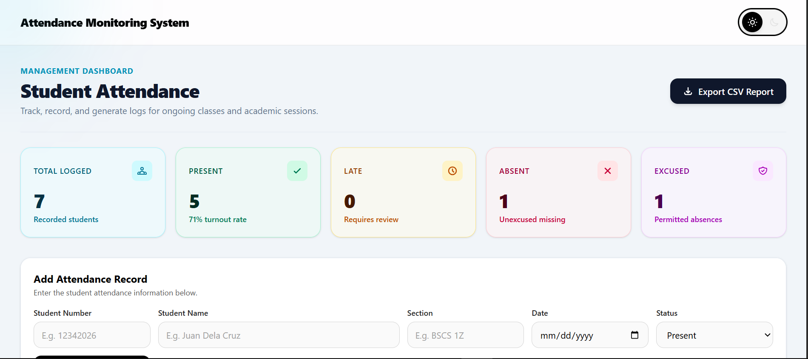
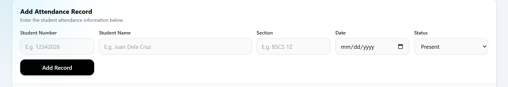
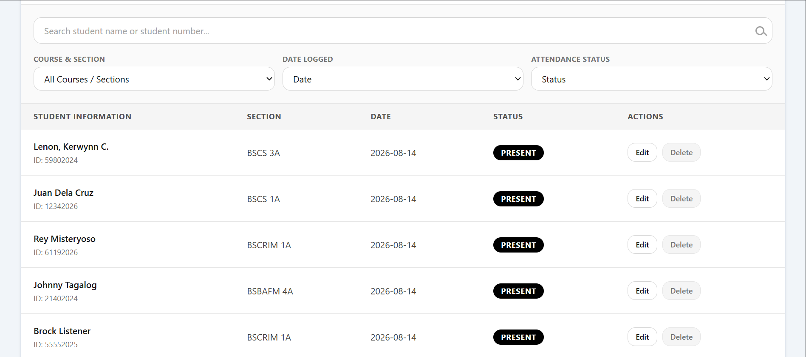
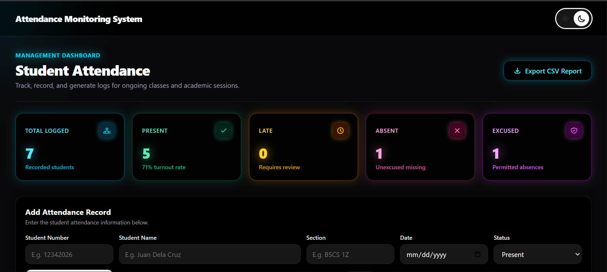

# Attendance Monitoring System

## Student Information

**Student Name:** Lenon, Kerwynn C.  
**Section:** BSCS 3A  
**Module:** Software Engineering 1 - Module 7  

---

## System Description

The **Attendance Monitoring System** is a web-based application designed to help teachers manage and monitor student attendance records.

The system allows teachers to add, view, edit, delete, search, and filter attendance records. It also provides attendance statistics for Present, Late, and Absent records.

The application was developed as a prototype implementation based on the architectural design created in Module 6.

### Selected Module 6 Entity

The selected entity from Module 6 is:

**Attendance Record**

An attendance record contains information about a student's attendance, including:

- Student Name
- Student Number
- Section
- Date
- Attendance Status
- Remarks

The Attendance Record serves as the main data entity managed by the system.

---

## Implemented Features

The following features are implemented in the system:

- Add student attendance records
- View attendance records
- Edit existing attendance records
- Delete attendance records
- Delete confirmation dialog
- Search attendance records
- Filter records by attendance status
- Display total attendance records
- Display Present records
- Display Late records
- Display Absent records
- Light mode and dark mode
- Theme preference saved using localStorage
- Attendance records saved using localStorage
- Responsive user interface for desktop and mobile devices
- Form validation
- Notification messages when records are added
- Reusable Vue.js components
- Responsive attendance table

---

## Technologies Used

### Frontend

- Vue.js
- JavaScript
- HTML5
- Tailwind CSS

### Development Tools

- Node.js
- npm
- Visual Studio Code
- Git
- GitHub

### Data Storage

- Browser localStorage

---

## System Architecture

The system follows the **three-tier architecture** proposed in Module 6.

The three architectural layers are:

1. Presentation Layer
2. Application Layer
3. Data Layer

### Presentation Layer

The presentation layer uses **Vue.js** and **Tailwind CSS**.

It is responsible for:

- Displaying the user interface
- Accepting user input
- Displaying attendance records
- Displaying attendance statistics
- Handling user interactions

### Application Layer

The application logic is handled by Vue.js components and JavaScript functions.

It is responsible for:

- Adding attendance records
- Updating attendance records
- Deleting attendance records
- Searching records
- Filtering records
- Calculating attendance statistics
- Validating user input
- Managing application state

### Data Layer

The prototype uses **browser localStorage** as its data storage mechanism.

It is responsible for:

- Saving attendance records
- Retrieving saved records
- Updating stored records
- Maintaining records after page refresh

---

## Installation and Run Instructions

### 1. Clone the Repository

Open Git Bash or a terminal and run:

```bash
git clone https://github.com/wynnnn26/lenon-module7-vue-system.git
````

### 2. Open the Project Folder

```bash
cd lenon-module7-vue-system
```

### 3. Install Dependencies

Install the required project dependencies:

```bash
npm install
```

### 4. Run the Development Server

Start the Vue development server:

```bash
npm run dev
```

The terminal will provide a local development URL, usually similar to:

```text
http://localhost:5173/
```

Open the provided URL in a web browser.

### 5. Build the Application

To create a production build, run:

```bash
npm run build
```

---

## localStorage Explanation

The Attendance Monitoring System uses the browser's **localStorage** to store attendance records.

When a new attendance record is added, the system converts the records into JSON format and saves them in localStorage.

For example:

```javascript
localStorage.setItem(
  'attendance-records',
  JSON.stringify(records)
)
```

When the application starts, it checks localStorage for previously saved attendance records:

```javascript
const savedRecords =
  localStorage.getItem('attendance-records')
```

The saved data is then converted back into JavaScript data and displayed in the system.

The system also uses localStorage to remember the user's selected theme:

```text
attendance-theme
```

This allows the attendance records and theme preference to remain available after refreshing the browser.

### Important Limitation of localStorage

localStorage stores data only in the user's browser. It is not a shared online database.

Therefore, attendance records stored on one computer or browser are not automatically available to another user or device.

---

## Connection Between Module 6 and Module 7

Module 6 focused on the **system architectural design**, while Module 7 focuses on the **prototype implementation** of the proposed system.

In Module 6, the Attendance Monitoring System was designed using a three-tier architecture consisting of:

1. Presentation Layer
2. Application Layer
3. Data Layer

The proposed technologies in the Module 6 architecture were:

* Vue.js for the Presentation Layer
* Node.js and Express for the Application Layer
* MongoDB Atlas for the Data Layer

For the Module 7 prototype, the frontend was implemented using **Vue.js, JavaScript, and Tailwind CSS**.

The application currently uses **localStorage** instead of MongoDB because the Module 7 implementation is a prototype.

The reusable Vue components developed in Module 7 represent the presentation and application responsibilities identified during the architectural planning in Module 6.

The current implementation can be extended in the future by replacing localStorage with the proposed Node.js, Express, and MongoDB backend.

---

## Application Screenshots

### Attendance Dashboard



### Add Attendance Record



### Attendance Records



### Dark Mode



---

## Known Limitations

The current prototype has several limitations:

* Attendance records are stored only in browser localStorage.
* There is no online database connection.
* There is no user authentication system.
* There are no separate teacher accounts.
* Attendance records cannot currently be shared between different devices.
* The system does not yet have a Node.js and Express backend.
* The system does not yet use MongoDB Atlas.
* The system does not currently support biometric attendance.
* The system does not currently support QR code attendance scanning.
* The prototype is intended for demonstration and academic purposes.

---

## Proposed Future Improvements

Future versions of the Attendance Monitoring System may include:

* Node.js and Express backend
* MongoDB Atlas database
* Teacher authentication and accounts
* Student account management
* Cloud-based attendance records
* Attendance report generation
* Dashboard charts and analytics
* Email notifications
* Multi-device synchronization
* Role-based access control
* Deployment to a production server

---

## Project Status

**Status:** Completed Prototype

The current version demonstrates the core attendance monitoring features and the frontend implementation of the system architecture planned in Module 6.

---

## Author

**Lenon, Kerwynn C.**

**BSCS 3A**
**Software Engineering 1 - Module 7**

